# Binary-City-Dev-Assessment

Welcome to the Binary City Dev Assessment project! This project showcases a comprehensive web application built using C# with ASP.NET MVC and Microsoft SQL Server (MSSQL), implementing Object-Oriented Programming (OOP) principles and adhering to best practices in code structure, consistency, and SQL table design. The application features a well-structured and user-friendly interface with robust input validation, ensuring a high-quality, professional product.

### 🌟Key Features

Clients Module

- Create Client: Easily add new clients with unique alphanumeric client codes auto-generated based on the client's name.
- View Clients: Display a list of clients ordered by name, client code and including the total number of linked contacts.
 
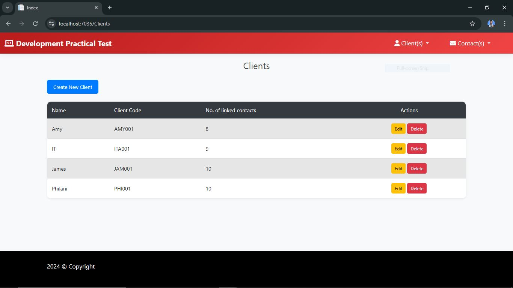

- If no client(s) are identified, the system will display the following message:
  
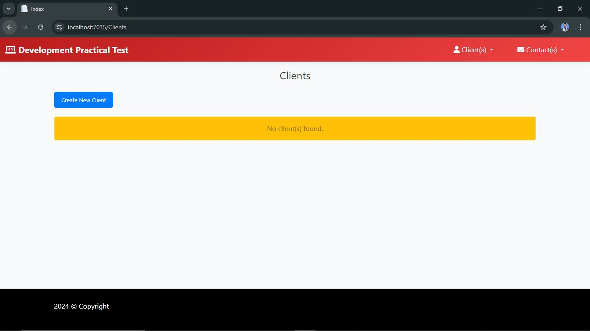

Client Form:

- General Tab: Input fields for client name, with client codes being generated in an alphanumeric format and shown in the list. The auto-generated code will not be visible to the client until it has been successfully saved to the database and subsequently shown in the list (please refer to the first image to see the auto-generated codes).
- Contact(s) Tab: View and manage contacts linked to the selected client, with options to unlink contacts.

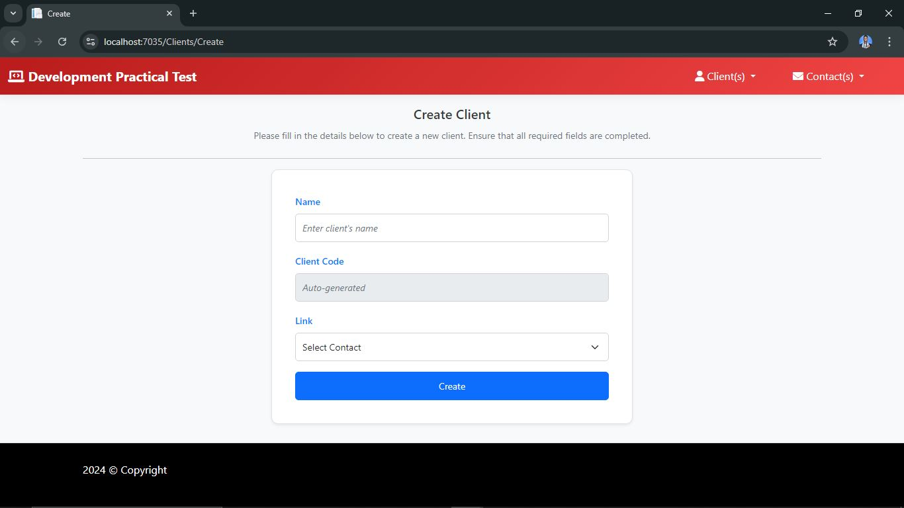

- Please note that feedback will be provided to the user upon input validation, indicating whether it was successful or if any errors occurred.

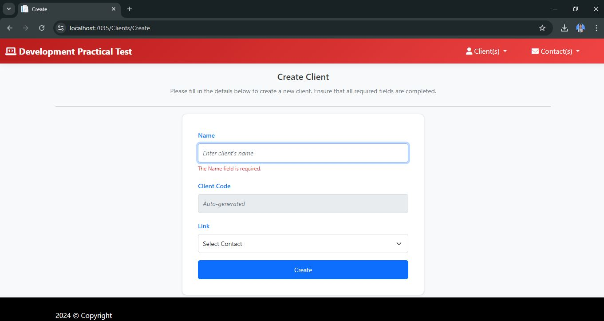

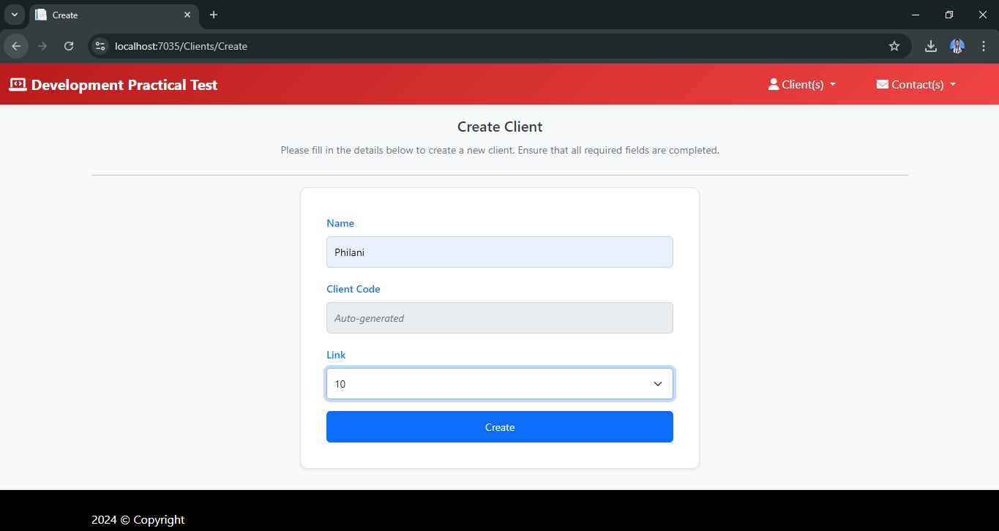

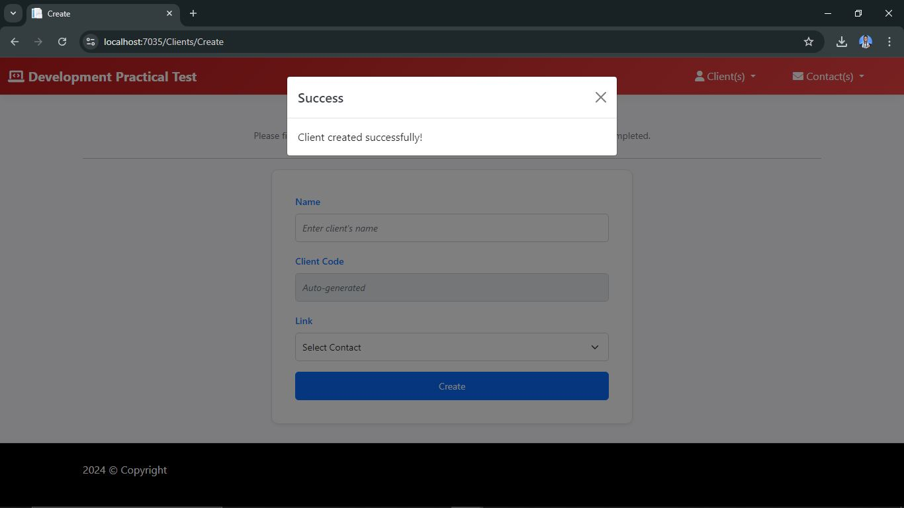

Contacts Module

- Create Contact: Add new contacts with unique email addresses and link them to multiple clients.
- View Contacts: Display a list of contacts ordered by full name ascending, with the number of linked clients.
- Client(s) Tab: View and manage clients linked to the selected contact, with options to unlink clients.


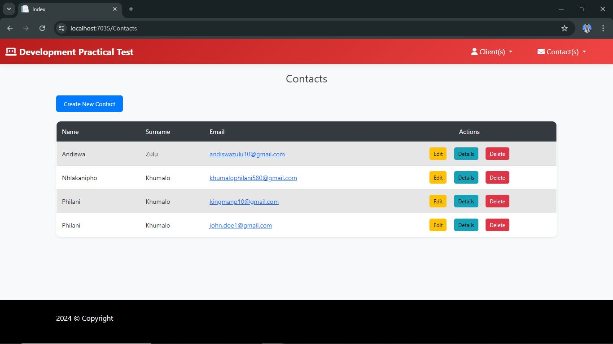

- If no contact(s) are identified, the system will display the following message:

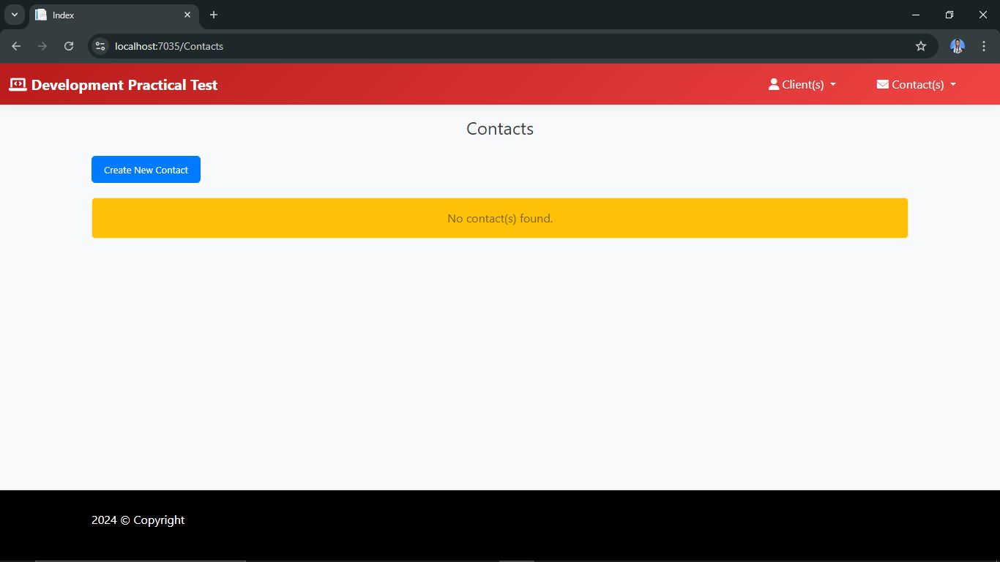

### Application Highlights

- Code Consistency & Structure: Adheres to best practices in code consistency, structure, and tidiness.
- SQL Best Practices: Focus on well-structured tables with proper indexing.
- User Feedback: Provides adequate feedback to users upon input validation failure.
- Input Validation: Strong input validation both on the client-side (JavaScript) and server-side (C#).
- MVC & OOP: Implements the Model-View-Controller (MVC) pattern, ensuring a scalable and maintainable architecture.

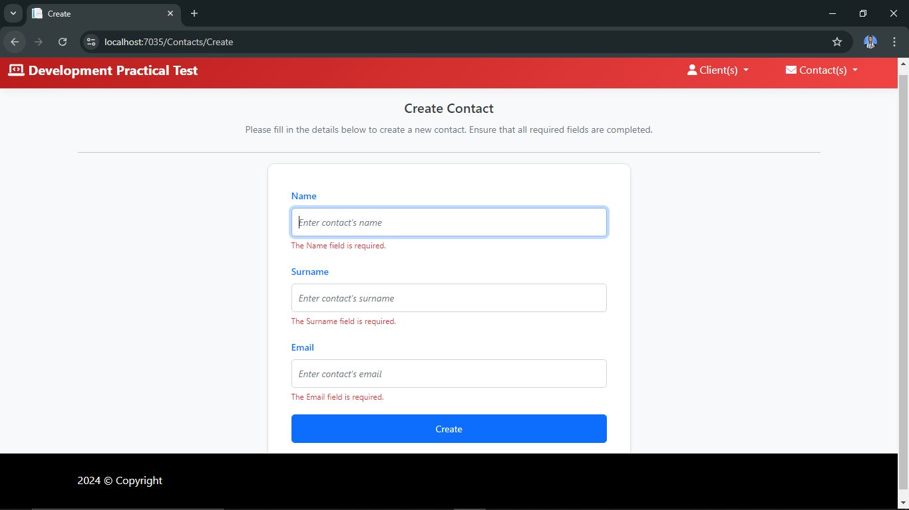

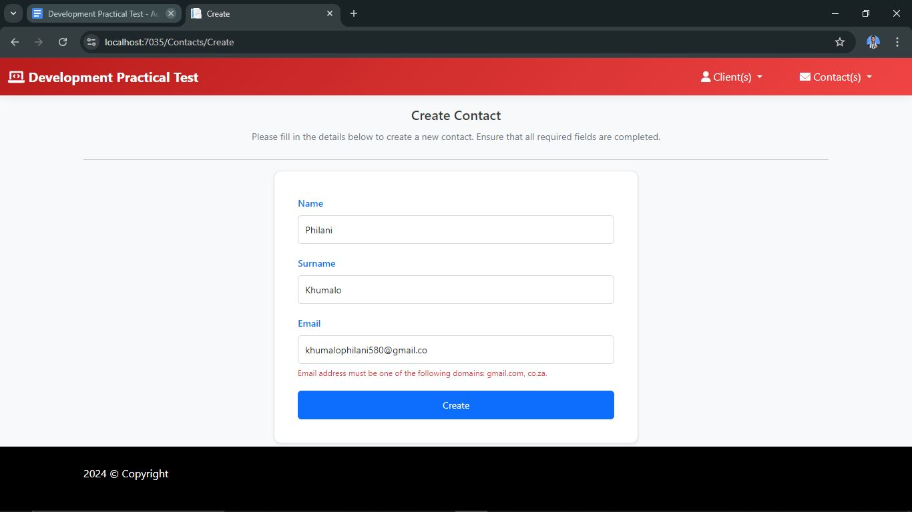

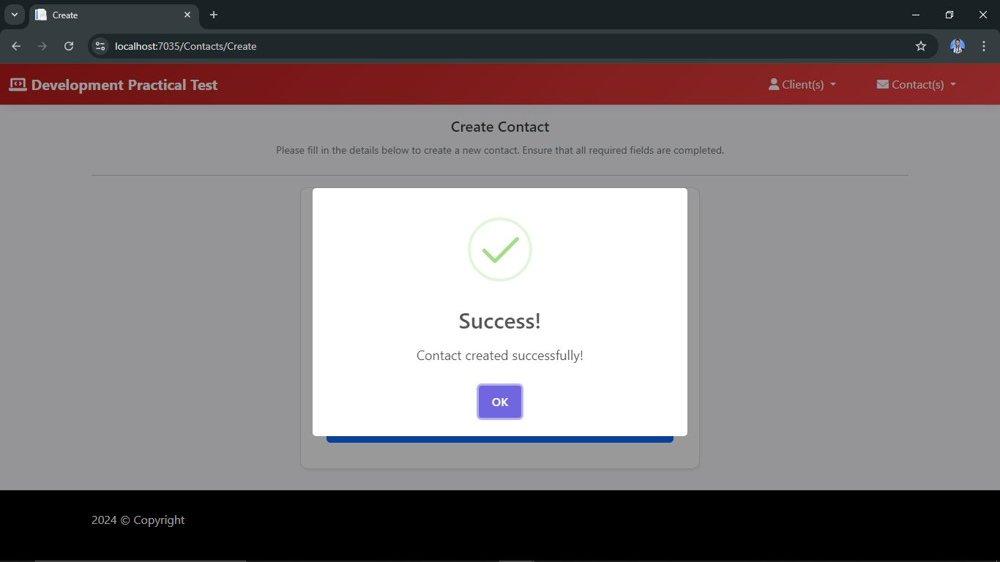

### 🛠️Technology Stack

- Backend: C# with ASP.NET MVC
- Database: Microsoft SQL Server (MSSQL)
- Frontend: HTML, CSS, JavaScript, AJAX for dynamic updates
- Version Control: Git

## 🧑‍💻 How to Run the Project

### Clone the Repository

Open your terminal and clone the repository using the following command:

```bash
git clone https://github.com/Philani56/Binary-City-Dev-Assessment.git
```

### Set Up the Database

Ensure you have Microsoft SQL Server (MSSQL) installed and running. Set up the database using the provided SQL scripts:

- Update Connection String: Edit the web.config file to configure the connection string to point to your MSSQL Server. Ensure it reflects your server name, database name, and authentication details.

### Build and Run the Application

Open the project in Visual Studio or your preferred C# IDE:

- Build the Solution: In Visual Studio, go to Build -> Build Solution to compile the project.
Run the Application: Click Start or press F5 to run the application. This will start the local server and open the application in your default web browser.

### Access the Application
Once the application is running, you can access it at http://localhost:<port>. Replace <port> with the port number specified in your project settings or the default port if not configured.

### Verify Functionality
Ensure that all features are working correctly by testing:

- Client Management: Create, view, and manage clients.
- Contact Management: Create, view, and manage contacts.
- Linking/Unlinking Operations: Verify that linking and unlinking of clients and contacts function as expected.

### Stop the Application

To stop the application:

- In Visual Studio: Click on the Stop button (a square icon) in the toolbar, or press Shift + F5 to stop debugging.
Command Line: If you’re running a web server or application server via command line, press CTRL + C in the terminal where the application is running to terminate the process.

### 🎨UI/UX Considerations
- The application’s UI is designed to be intuitive and easy to navigate.
- Tabs are used to segregate different sections of forms for better user experience.
- Responsive feedback mechanisms are in place for better user interaction.

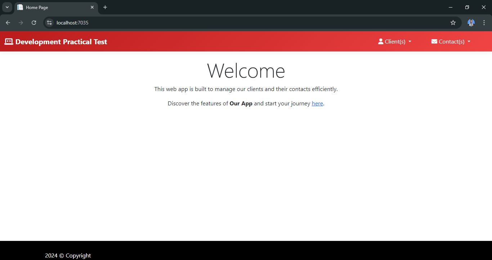
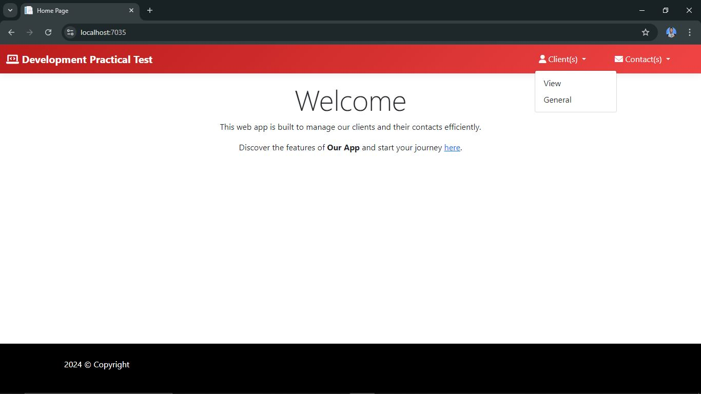
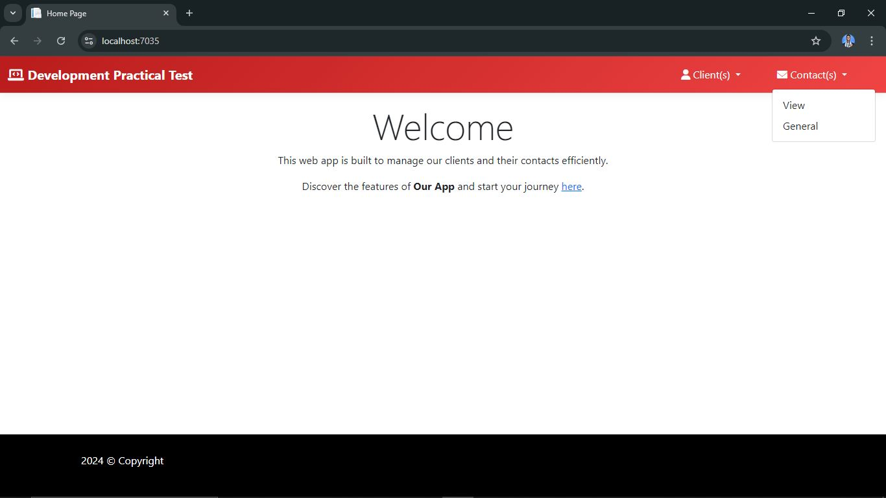

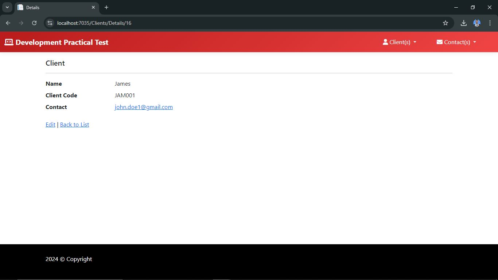


### 📊Database Structure
- Clients Table: Columns include Name, Client Code, No. of Linked Contacts.
- Contacts Table: Columns include Name, Surname, Email, No. of Linked Clients.

### 🔗Branch Information
- Please note that the main branch of this repository is on master instead of main. Update your local references accordingly.

### 📞Contact
For any inquiries or issues, please contact:

- Email: khumalophilani580@gmail.com
- LinkedIn: [LinkedIn](https://www.linkedin.com/in/nhlakanipho-philani-khumalo-679726224/)
  

